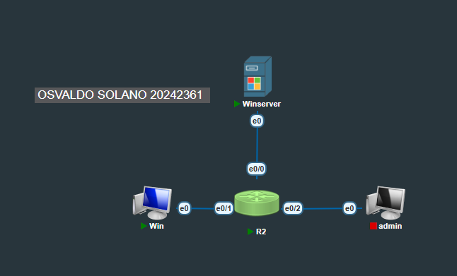
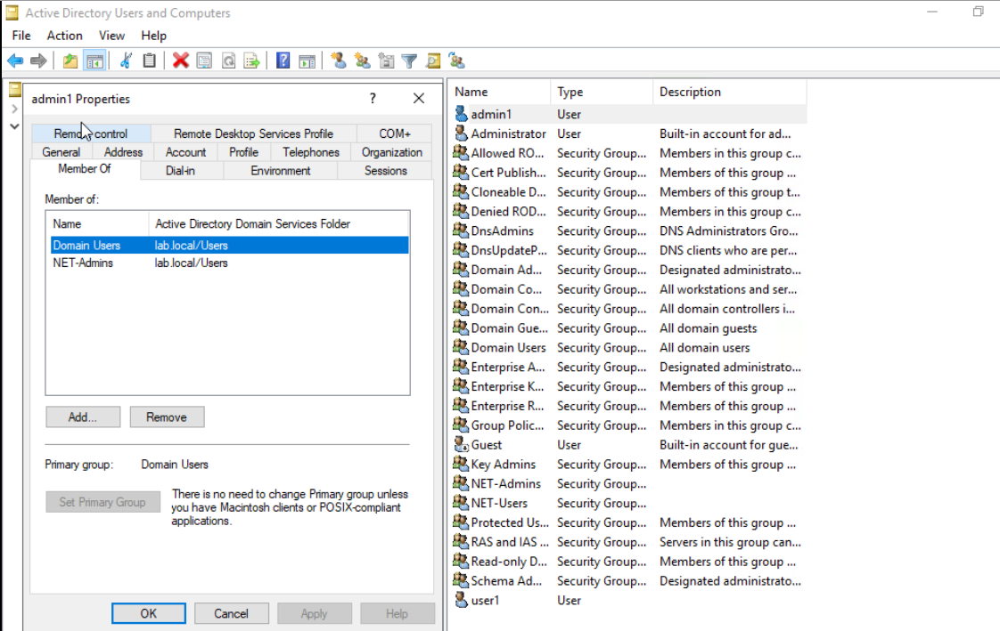
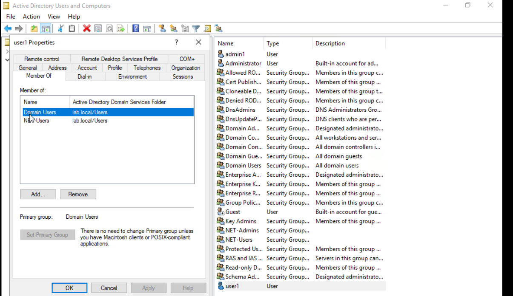
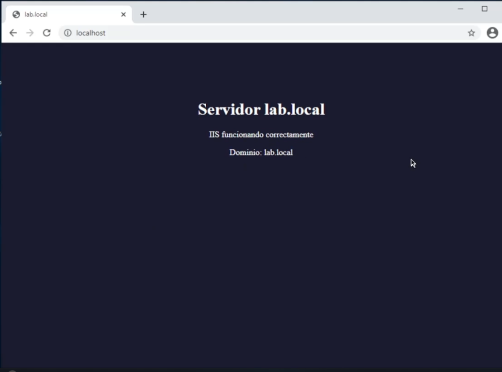
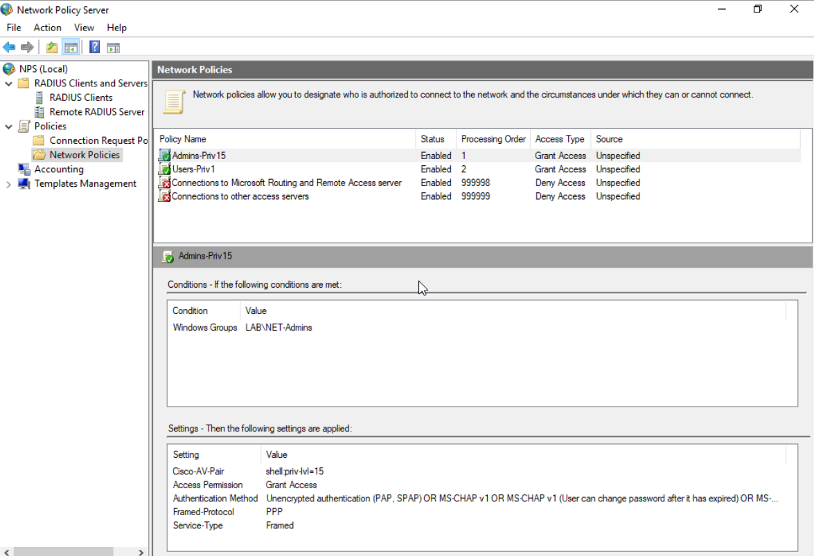
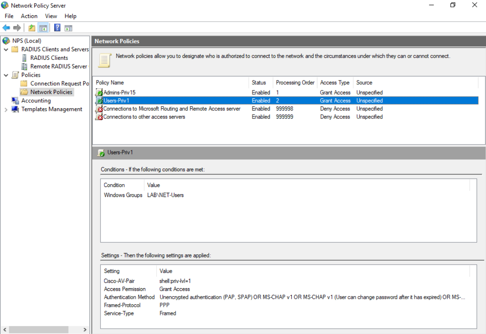

# RemoteApp + IIS + AAA (RADIUS/NPS) en PNetLab

Implementación de una infraestructura empresarial utilizando **Windows Server 2016**, **Cisco IOS** y **PNetLab**, integrando Active Directory, IIS, RemoteApp y autenticación centralizada mediante RADIUS (NPS).

---

# Objetivos

- Implementar un dominio Active Directory.
- Configurar un servidor web IIS.
- Publicar aplicaciones mediante RemoteApp.
- Configurar RD Web Access.
- Implementar autenticación AAA mediante RADIUS.
- Asignar privilegios automáticamente según grupos de Active Directory.
- Validar el funcionamiento de toda la infraestructura.

---

# Topología

La siguiente topología fue utilizada para implementar el laboratorio.



---

# Direccionamiento IP

| Dispositivo | Función | Dirección IP |
|-------------|----------|--------------|
| Windows Server | AD DS + IIS + RemoteApp + NPS | 23.6.10.10/24 |
| Router Cisco R2 | Cliente RADIUS | 23.6.10.1 |
| Windows Cliente | RD Web | 23.6.20.10/24 |
| PC Administración | Administración | 23.6.30.x/24 |

---

# Tecnologías utilizadas

- Windows Server 2016
- Cisco IOS
- Active Directory Domain Services
- DNS
- IIS
- Remote Desktop Services
- RemoteApp
- RD Web Access
- Network Policy Server (NPS)
- AAA
- RADIUS
- PNetLab

---

# Active Directory Domain Services

Se promovió el servidor como Controlador de Dominio utilizando el dominio:

```
lab.local
```

Se crearon los siguientes grupos:

- NET-Admins
- NET-Users

También se crearon los usuarios:

- admin1
- user1






---

# IIS

Se instaló el rol **Internet Information Services (IIS)**.

Se creó una página personalizada mostrando:

- Nombre del servidor
- Dominio
- Estado del servicio
- Información del laboratorio



---

# Remote Desktop Services (RemoteApp)

Se instaló:

- RD Connection Broker
- RD Web Access
- RD Session Host

Se publicó **Google Chrome** como aplicación RemoteApp.

Además, Chrome fue configurado para abrir automáticamente:

```
http://localhost
```


---

# RD Web Access

Se habilitó el portal web de RemoteApp.

Dirección utilizada:

```
https://23.6.10.10/RDWeb
```

Desde este portal los usuarios pueden acceder a:

- Google Chrome
- Calculadora
- Paint
- WordPad


---

# Network Policy Server (NPS)

Se instaló el rol **Network Policy Server**.

Se agregó el router Cisco como cliente RADIUS.

Servidor:

```
23.6.10.10
```

Shared Secret:

```
Test123
```

Se crearon dos políticas:

### Admins

Grupo:

```
NET-Admins
```

Atributo Cisco:

```
shell:priv-lvl=15
```

### Users

Grupo:

```
NET-Users
```

Atributo Cisco:

```
shell:priv-lvl=1
```






---

# Configuración AAA del Router Cisco

Se configuró:

- AAA New Model
- Authentication
- Authorization
- Accounting
- RADIUS
- Fallback a usuarios locales

Servidor configurado:

```
23.6.10.10
```

Puertos:

```
1812 Authentication

1813 Accounting
```

## 📷 Imagen de la configuración AAA aquí

---

# Flujo de autenticación

```
Usuario

↓

Router Cisco

↓

AAA

↓

Servidor RADIUS

↓

Active Directory

↓

Grupo del usuario

↓

Cisco AV Pair

↓

Nivel de privilegio

↓

Acceso al Router
```

---
## Comandos de verificación

Se comprobó el estado del servidor AAA mediante:

```bash
show aaa servers
```


También se verificaron las sesiones AAA activas.

```bash
show aaa sessions
```


---


# Resultados obtenidos

✔ Active Directory funcionando correctamente.

✔ IIS publicando la página web.

✔ RemoteApp funcionando correctamente.

✔ RD Web Access operativo.

✔ NPS autenticando usuarios mediante RADIUS.

✔ Router Cisco autenticando usuarios mediante Active Directory.

✔ Asignación automática de privilegios según el grupo del usuario.

---

# Requisitos

- Windows Server 2016 o superior
- Cisco IOS compatible con AAA
- PNetLab
- Windows Cliente
- Conectividad IP entre todos los equipos


Este proyecto fue desarrollado con fines educativos para prácticas de infraestructura empresarial, administración de Windows Server y autenticación centralizada mediante RADIUS en PNetLab.
